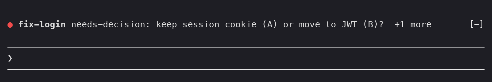
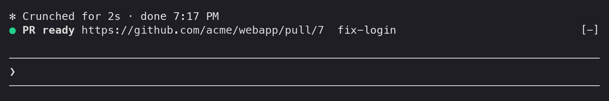

# firstmate-mods


Claude Code mods for [firstmate](https://github.com/kunchenguid/firstmate) fleets, published as a Claude Code plugin marketplace.

| Mod | What it does |
| --- | --- |
| [fleet-lamp](#fleet-lamp) | A lamp above the prompt: red when the fleet needs you, green when a PR is ready. |
| [pr-weather](#pr-weather) | The CI weather of the fleet's open PRs above the prompt: one glyph per PR. |

## Install

```sh
claude plugin marketplace add jayjongcheolpark/firstmate-mods
claude plugin install fleet-lamp@firstmate-mods
claude plugin install pr-weather@firstmate-mods
```

To try a local checkout without installing it, start a session with the plugin folder loaded:

```sh
claude --plugin-dir /path/to/firstmate-mods/plugins/fleet-lamp
claude --plugin-dir /path/to/firstmate-mods/plugins/pr-weather
```

## fleet-lamp

A band above the prompt that tells you when the fleet needs a human. You don't need a lamp.

A task needs a decision (red), with one more open red behind it:



A PR is ready for review (green):



Both images come from a live session at 90 columns: the terminal screen the session drew, rendered with a dark palette. The band draws its dot in the theme's `error` color for red and its `success` color for green, and draws the task (or `PR ready`) in bold.

When nothing needs you, the band shows nothing.

### What it shows

- 🔴 **Red** (strongest): a task is waiting on you. The band shows the task, its state and its reason. The reason is the status text without the status line's own lead (the state word, any `[key=...]`, `[at=...]` or `[corr=...]` tags and the colon), so `needs-decision [key=pick]: A or B?` shows as `needs-decision: A or B?`. The newest open red comes first, and `+N more` counts the others.
- 🟢 **Green**: a PR is ready for review. The band shows the PR URL and its task.
- **Nothing**: the fleet doesn't need you.

The lamp is always one line. When it does not fit the band, the reason (or, for green, the task after the URL) is cut first, with `…`, down to 16 cells; then the task (or the URL), down to 12 cells; then the reason goes. The dot and `+N more` are never cut. The mod measures in terminal cells, so Korean and other wide text counts double, and in the terminal it leaves the last four cells for the band's `[-]` control.

### The rules

The band reads only `task.status` and `task.pr_ready` records from firstmate's fleet activity ledger, `state/fleet-ledger.jsonl` (see `docs/fleet-ledger.md` in the firstmate repository), in the session's own firstmate home only.

- **Red**: a `task.status` record whose state is `needs-decision`, `blocked` or `failed`. Two kinds of record are left out:
  - worker validation findings that firstmate decides itself (text contains `ask-user findings=`);
  - a held decision recorded again with the captain's own answer (`Captain 2026-09-30 verbatim ...`).
- A **keyed** red (a record with a `[key=...]` decision key) turns off by itself when a later `resolved` record carries the same task and key.
- A **keyless** red stays until your next prompt.
- **Green** (latched): a `task.pr_ready` record, or a `done` record that reports a ready PR (`PR https://...`, `child X done: PR https://...`, `PR ready: https://...`). A `done` record that says the PR already `landed` or `merged` does not count. Green stays until your next prompt.
- **Your next prompt clears the band**, red and green alike. Only a prompt you send counts, typed at the terminal or sent through Remote Control. Task notifications, messages from other sessions and scheduled prompts leave the band as it is.

These are the same rules as the lamp script that inspired this mod.

### Turning on the ledger

The ledger is opt-in. In your firstmate home, create the flag:

```sh
touch config/fleet-ledger
```

Delete the flag to turn the ledger off. While the ledger is off, the band shows nothing. The first time a session finds the home's ledger off, the mod adds one dim line to the transcript that tells you how to turn it on.

### How it finds your fleet

The mod looks for the firstmate home at or above the session's working directory: the nearest directory whose `AGENTS.md` has a `# Firstmate` heading line and that has a `state/` folder. Start your firstmate session in its home, as usual, and the mod finds it. A `claude -p` run or an SDK session, where no one is at the prompt, follows no ledger.

To follow a home from somewhere else, set the plugin's `home` option in `/config`, or from a shell:

```sh
echo '{"home": "~/firstmate"}' | claude plugin configure fleet-lamp@firstmate-mods --values-stdin
```

### Second mates

The mod does not follow the ledgers of second mate homes. You do not see a second mate's decisions, so a red in a second mate's ledger is not yours yet. When the second mate passes a decision up, the main firstmate records it in the main ledger, and the band turns red then.

The mod reads only the `config/fleet-ledger` flag and `state/fleet-ledger.jsonl` in the home. It reads no other state file, makes no network calls and controls no hardware.

### How it reads the ledger

- The mod checks the ledger every 2 seconds and reads only the lines added since the last check, from a saved byte offset. A partial last line waits for the next check.
- On the first look at the ledger in a session, the mod starts at its end, so old history does not turn the band red.
- The offset and the signals are kept in the session's state, so a reload of the mod does not read old lines again.
- If the ledger is truncated, the mod reads it again from the top.
- The ledger never rotates, and `$.fs.read` reads whole files of at most 4 MiB. So the mod reads the new bytes with `tail -c +<offset>`.

### Developing

```sh
claude plugin validate .                    # the marketplace
claude plugin validate plugins/fleet-lamp   # the plugin and its hooks module
claude plugin test plugins/fleet-lamp       # the rule, line fitting and band tests
npx -p typescript tsc -p plugins/fleet-lamp  # type-check, once a session has loaded the mod
```

A session that loads the mod from a folder you own (`--plugin-dir`) writes the API types to `plugins/fleet-lamp/.claude-plugin/types/`, which `tsconfig.json` extends.

The rules are pure functions in `plugins/fleet-lamp/hooks/rules.ts`, and the one-line fitting is in `plugins/fleet-lamp/hooks/line.ts`. The hooks module that reads the ledger and draws the band is `plugins/fleet-lamp/hooks/register.tsx`.

## pr-weather

A band above the prompt with the CI weather of the PRs your firstmate fleet is working on, one glyph per PR:

```text
PRs ☂ #7 ↯ #9 ⚔ #11 ✎ #10 ☀ #12 +2 more updated 2m ago [ ↻ ] [ auto ]
```

### What it shows

| Glyph | Meaning |
| --- | --- |
| ↯ (magenta) | A workflow run on the PR's head commit is held for approval: a human has to approve it. |
| ☂ (red) | A check failed, was cancelled or timed out. |
| ⚔ (red) | The PR has merge conflicts with its base branch. While GitHub is still computing mergeability, the PR shows its CI glyph. |
| ☁ (yellow) | Checks are pending, queued or in progress. |
| ✎ (gray) | The PR is a draft. |
| ☀ (green) | Every check passed. |
| - (gray) | The PR has no checks. |

When more than one applies, the first in the table wins: a draft with a failed check shows ☂.

After the PRs come:

- `+N more` when the PRs do not fit on one line;
- `updated 2m ago`, the time of the last successful refresh;
- `(stale)` when the last refresh failed, so the glyphs are from an earlier one. When the lookup of one PR fails, that PR alone keeps its last glyph, or stays out of the band until a lookup succeeds;
- `low quota, every 12m` while auto mode backs off, or `rate-limited, resets in 17m` while GitHub's rate limit holds every refresh;
- the refresh button `[ ↻ ]` (`[ … ]` while a refresh runs) and the mode button `[ auto ]` or `[ manual ]`.

### Opening a PR

Press a PR's `#N` to open it, in any terminal:

- **Fullscreen layout**: click `#N`.
- **Default layout**: focus the band with `ctrl+x tab`, move to `#N` with `tab`, and press `Enter`.
- **Desktop**: click `#N`.

What a press does depends on where the session runs:

- **A local Mac** runs `open <url>`, which opens the PR in your default browser, and shows `Opened PR #N`.
- **A local Linux desktop** (with `DISPLAY` or `WAYLAND_DISPLAY` set) runs `xdg-open <url>` and shows `Opened PR #N`.
- **Anywhere else**, the mod copies the PR URL to your clipboard and shows `Copied PR #N URL`. That covers an SSH session (`SSH_CONNECTION`, `SSH_TTY` or `SSH_CLIENT` set) and a Linux server without a desktop, such as one you reach through a terminal multiplexer. In the terminal the copy goes through the terminal's clipboard (OSC 52, as `/copy` does), so it lands on the machine you are sitting at. Paste the URL into your browser.
- If the opener fails, the mod copies the URL instead, and the toast says why first: `open exited 1; copied PR #N URL`, or `open failed: <error>; copied PR #N URL`. If the copy fails too, the toast shows the reason and the URL itself.

Each press also writes lines to the Claude Code debug log, which Claude Code writes only when you start it with `claude --debug` or `--debug-file <path>`. Find them with `grep 'pr-weather press'`. The first line shows that the press arrived. The second line shows the opener argv and its result:

```text
pr-weather press #7 https://github.com/acme/webapp/pull/7 opener=none pressed
pr-weather press #7 https://github.com/acme/webapp/pull/7 opener=["open","https://github.com/acme/webapp/pull/7"] exit=0 stderr=""
```

In the second line, `exit=<code> stderr="<text>"` means the opener ran. `error="<message>"` means it could not run, for example a timeout. `opener=none copy=no-local-browser` means the session has no local browser to open.

The mod opens only `https://github.com/<owner>/<repo>/pull/<n>` URLs, runs the opener without a shell, and gives it 10 seconds.

The weather glyph before each `#N` is also a terminal hyperlink to the PR (cmd-click, handled by the terminal itself) where Claude Code draws terminal hyperlinks: Ghostty, iTerm2, WezTerm, kitty, Alacritty, Warp, Hyper and the VS Code terminal. If your terminal supports OSC 8 hyperlinks but is not on that list (Kaku, for example), set `FORCE_HYPERLINK=1` in Claude Code's environment. On the desktop the glyph is always a link.

When there are no open PRs, the band shows `PRs none` and the buttons.

### Refreshing

- **auto** (default): the mod refreshes on the interval, every 3 minutes unless you change it.
- **manual**: the mod loads once when the session starts and then refreshes only when you ask.

To refresh now, press `[ ↻ ]` or run `/pr-weather refresh`. That works in both modes, at most once every 30 seconds.

To switch modes, press the mode button or run `/pr-weather mode auto` or `/pr-weather mode manual`. The choice is kept across sessions until you change the `mode` setting itself.

To press a band button from the keyboard, focus the band with `ctrl+x tab` and press `r` (refresh) or `m` (mode), or move to a button with `tab` and press `Enter`. In the fullscreen layout you can also click them.

### Rate limits

Each refresh first reads your remaining GitHub quota with `gh api rate_limit`, which does not count against the quota.

- Below 10% remaining (of the REST or GraphQL quota, whichever is lower), auto mode doubles its interval each refresh, up to 30 minutes, and the band says so. When the quota recovers, the interval returns to normal.
- When the quota is used up, or GitHub answers a call with a rate-limit error, the band is marked stale and no refresh runs, by hand or on the interval, until the quota resets.

### Which PRs

With the default `fleet` source, the PRs come from firstmate's fleet activity ledger, `state/fleet-ledger.jsonl` (see `docs/fleet-ledger.md` in the firstmate repository):

- a `task.pr_ready` record adds its PR, and a later one for the same task replaces it;
- a `done` status record that reports a ready PR does the same, by fleet-lamp's green rule (`PR https://...`, `PR ready: https://...`, `child X done: PR https://...`);
- a `task.merged` or `task.cleaned_up` record for that task removes it, and so does a `done` record that says the PR `landed` or `merged`;
- a PR that GitHub reports as merged or closed is left out.

The ledger is opt-in: create the flag `config/fleet-ledger` in your firstmate home. Until the ledger exists, the band shows nothing, and the mod adds one dim line to the transcript that tells you how to turn it on.

The mod also reads the ledgers of the second mate homes registered in the home's `data/secondmates.md`: every entry with `(home: <absolute path>; ...)` whose directory exists on this machine. Remote entries (`host: ...; root: ...; home: ...`) are skipped, so the mod makes no SSH calls. Unlike fleet-lamp, which follows the main home alone, pr-weather shows second mate PRs. The band shows the PRs of every home, each PR once. A second mate home without a ledger is left out, with one dim line in the transcript that names it. While the main home has no ledger but a second mate does, the band shows the second mate's PRs and the mod adds the turn-it-on line once. Each refresh reads `data/secondmates.md` again, so a new second mate shows on the next refresh. Turn off `includeSecondMates` to read the main home alone.

The band shows only in a firstmate session: one whose working directory is at or under a firstmate home (a directory whose `AGENTS.md` has a `# Firstmate` heading line and that has a `state/` folder). In any other session the mod draws nothing and makes no calls. With either source, a `claude -p` run or an SDK session, where no one is at the prompt, also draws nothing and makes no calls.

With the `mine` source, the band shows your own open PRs in the session's repository (`gh pr list --author @me`), in any session inside a git repository.

### Settings

Set these in `/config`, or from a shell:

```sh
echo '{"mode": "manual", "refreshMinutes": 5}' | claude plugin configure pr-weather@firstmate-mods --values-stdin
```

| Setting | Default | What it does |
| --- | --- | --- |
| `source` | `fleet` | `fleet`: the fleet ledger's PRs, in firstmate sessions. `mine`: your open PRs in the session's repository. |
| `mode` | `auto` | `auto` refreshes on the interval; `manual` refreshes only when you ask. |
| `refreshMinutes` | `3` | How often auto mode refreshes, in minutes (at least 1). |
| `home` | empty | The firstmate home to read (`~` allowed). Empty: the nearest one at or above the session's working directory. When set, the band shows in every session. |
| `includeSecondMates` | `true` | Also read the ledgers of the home's local second mate homes (`fleet` source). |

### Requirements

The [GitHub CLI](https://cli.github.com) (`gh`), logged in (`gh auth login`). The mod reads GitHub only through `gh` with JSON output. If `gh` is missing or not logged in, the band shows nothing and the mod adds one dim line to the transcript that says what to do.

Each refresh makes one `gh api rate_limit` call, then two calls per PR: `gh pr view --json` for the checks and draft state, and `gh api .../actions/runs?head_sha=...` for runs held for approval.

### Developing

```sh
claude plugin validate plugins/pr-weather   # the plugin and its hooks module
claude plugin test plugins/pr-weather       # the weather, ledger, second mate, layout, mode, opening and band tests
npx -p typescript tsc -p plugins/pr-weather  # type-check, once a session has loaded the mod
```

The pure parts (glyphs, check classification, the ledger, the band layout, quota and backoff) are in `plugins/pr-weather/hooks/weather.ts`, the URL check and opener choice are in `plugins/pr-weather/hooks/open.ts`, and the `data/secondmates.md` parser is `plugins/pr-weather/hooks/secondmates.ts`. The hooks module that calls `gh`, schedules refreshes and draws the band is `plugins/pr-weather/hooks/register.tsx`.
